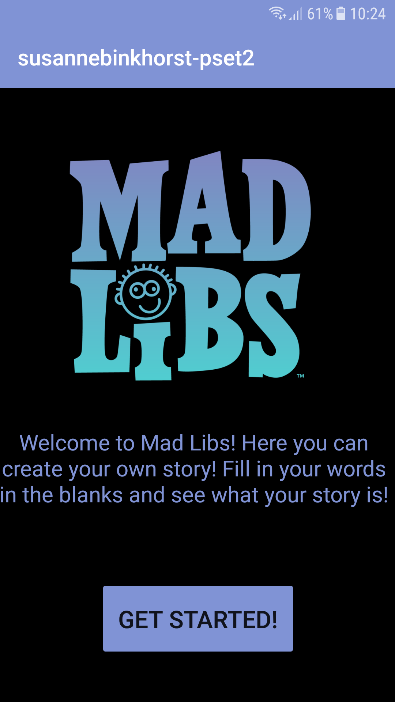
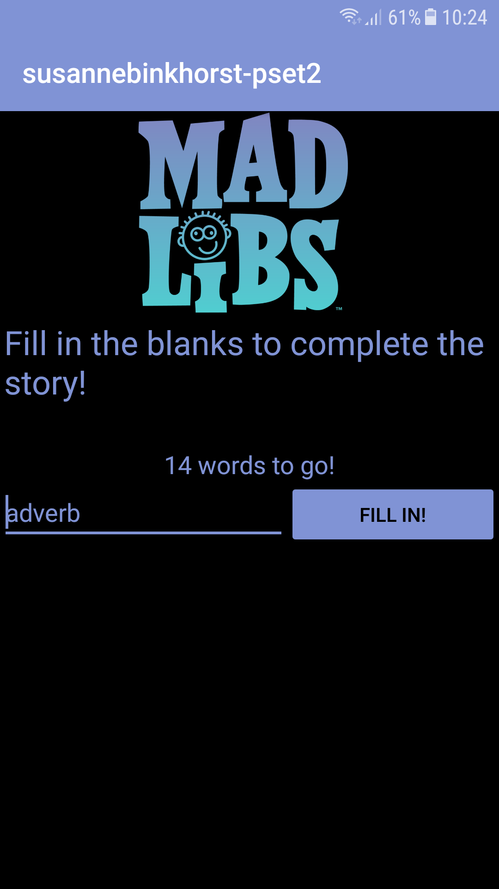
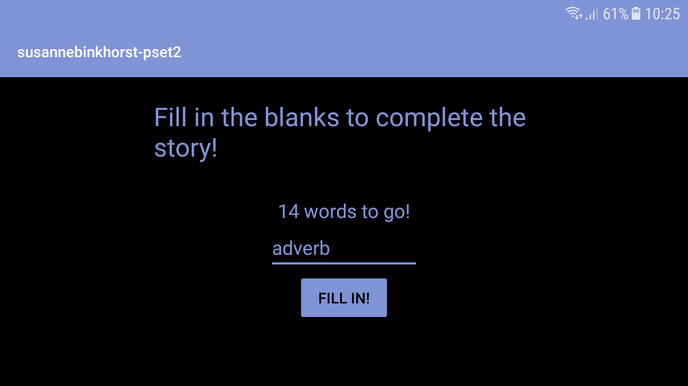
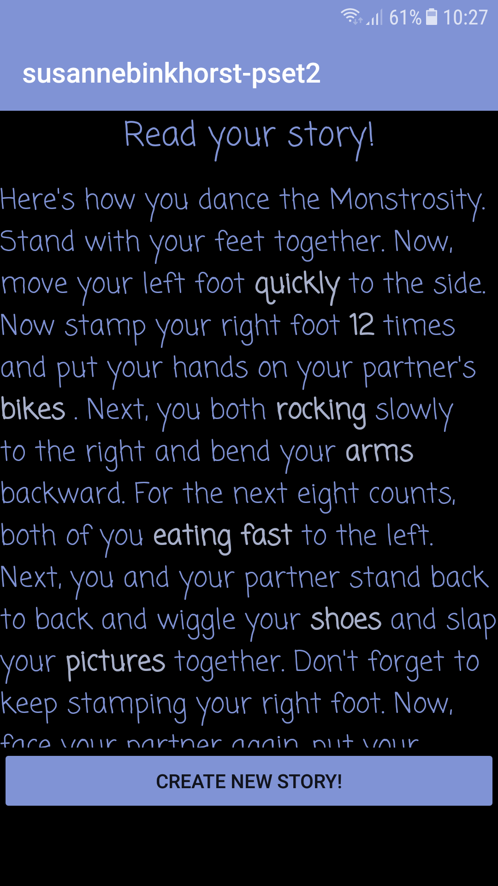
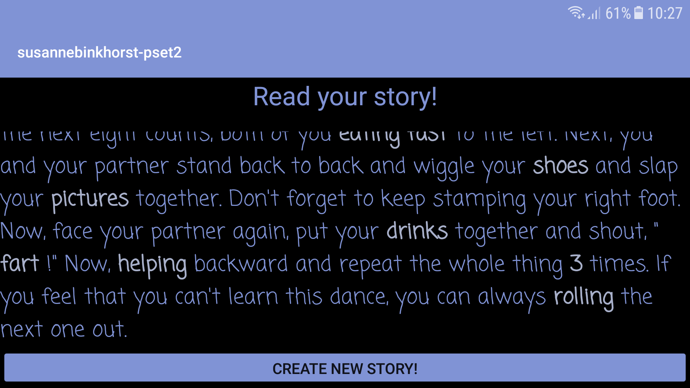

### susannebinkhorstpset2
### MadLibs

MadLibs is an app that let's the user create it's own story. There are 5 different stories to choose
from or you can choose random. The user should fill in the blanks with words that fit the type, like noun, 
adjective, colour, etc. After all the words are filled in, the user get's to read the whole story. The 
filled in words are bold and white-ish so the user can recognize it's own words.

